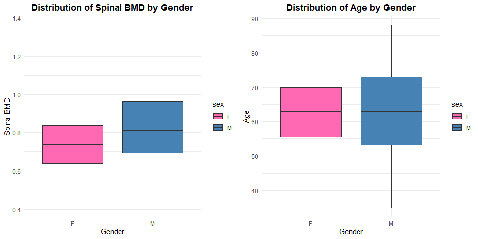
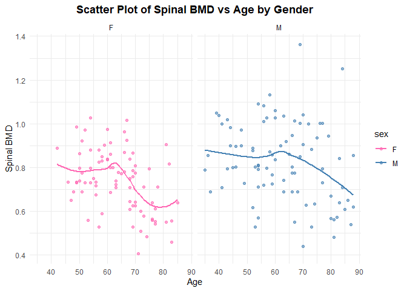
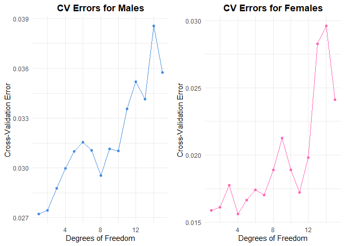
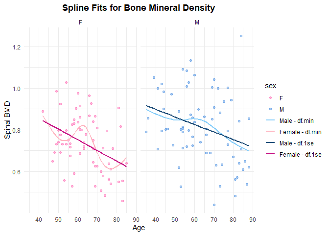
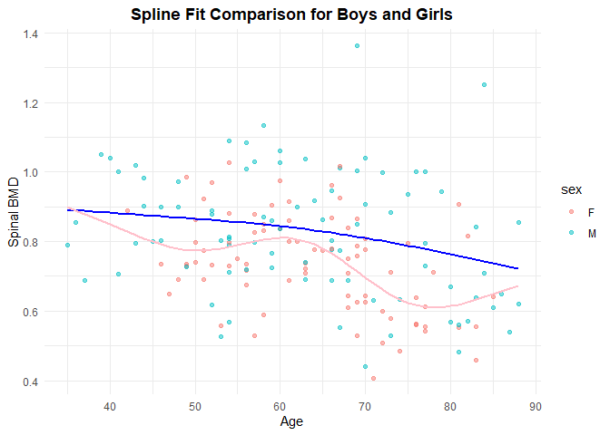
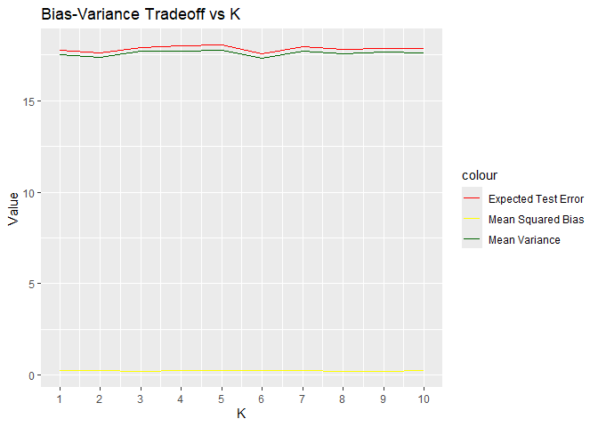
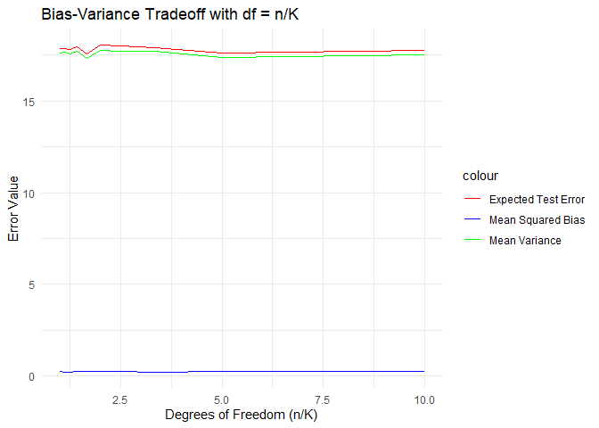
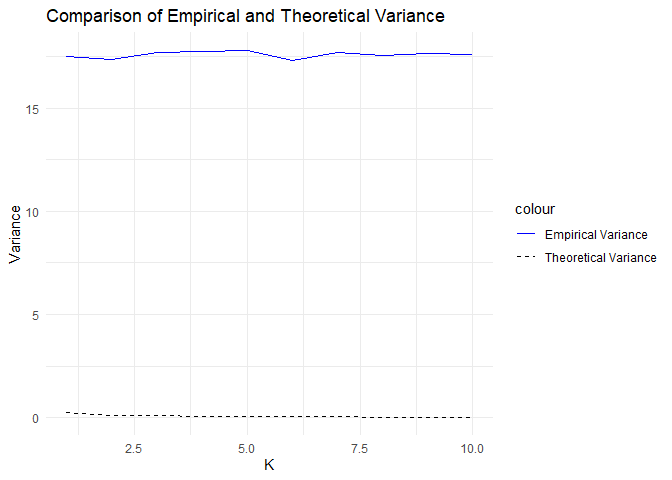

FA4 DSC1107
================
Lindsay Faith Bazar
March 09, 2025

``` r
suppressPackageStartupMessages(suppressWarnings({
library(tidyverse) 
library(readxl) 
library(knitr) 
library(kableExtra)
library(cowplot)
library(gridExtra)
library(FNN)
library(caret)
library(mgcv)
library(splines)
library(boot)
}))
```

## 1. Case study: Bone mineral density

### 1.1 Import

``` r
bmd_raw <-read_xlsx("bmd-data.xlsx")
bmd_raw
```

    ## # A tibble: 169 × 9
    ##    idnum   age sex   fracture weight_kg height_cm medication waiting_time spnbmd
    ##    <dbl> <dbl> <chr> <chr>        <dbl>     <dbl> <chr>             <dbl>  <dbl>
    ##  1   469  57.1 F     no frac…        64      156. Anticonvu…           18  0.879
    ##  2  8724  75.7 F     no frac…        78      162  No medica…           56  0.795
    ##  3  6736  70.8 M     no frac…        73      170. No medica…           10  0.907
    ##  4 24180  78.2 F     no frac…        60      148  No medica…           14  0.711
    ##  5 17072  54.2 M     no frac…        55      161  No medica…           20  0.791
    ##  6  3806  77.2 M     no frac…        65      168  No medica…            7  0.730
    ##  7 17106  56.2 M     no frac…        77      159  No medica…           26  1.01 
    ##  8 23834  49.9 F     no frac…        59      150  No medica…            9  0.731
    ##  9  2454  68.4 M     no frac…        64      167  Glucocort…            6  0.689
    ## 10  2088  66.3 M     no frac…        72      160. No medica…           10  0.947
    ## # ℹ 159 more rows

## 1.2 Tidy

The dataset is structured in a wide format with variables including:

``` r
colnames(bmd_raw)
```

    ## [1] "idnum"        "age"          "sex"          "fracture"     "weight_kg"   
    ## [6] "height_cm"    "medication"   "waiting_time" "spnbmd"

The data appears to be in a relatively tidy format. However, we will
fixed some datatypes such as the age format. As I’ve noticed that age
was stored in decimals. So, I changed it to integers to keep things
neat.

``` r
bmd <- bmd_raw %>%
  mutate(age = as.integer(floor(age)))
```

Some columns, like `sex`, `fracture`, and `medication`, only have a few
possible values. Instead of treating them as characters, I converted
them into a “category” format, which helps make the data more efficient
and easier to work with.

``` r
med_count <- bmd %>%
  count(medication)
med_count
```

    ## # A tibble: 3 × 2
    ##   medication          n
    ##   <chr>           <int>
    ## 1 Anticonvulsant      9
    ## 2 Glucocorticoids    24
    ## 3 No medication     136

``` r
bmd <- bmd %>%
  mutate(
    sex = as.factor(sex),
    fracture = as.factor(fracture),
    medication = as.factor(medication)
  )
bmd
```

    ## # A tibble: 169 × 9
    ##    idnum   age sex   fracture weight_kg height_cm medication waiting_time spnbmd
    ##    <dbl> <int> <fct> <fct>        <dbl>     <dbl> <fct>             <dbl>  <dbl>
    ##  1   469    57 F     no frac…        64      156. Anticonvu…           18  0.879
    ##  2  8724    75 F     no frac…        78      162  No medica…           56  0.795
    ##  3  6736    70 M     no frac…        73      170. No medica…           10  0.907
    ##  4 24180    78 F     no frac…        60      148  No medica…           14  0.711
    ##  5 17072    54 M     no frac…        55      161  No medica…           20  0.791
    ##  6  3806    77 M     no frac…        65      168  No medica…            7  0.730
    ##  7 17106    56 M     no frac…        77      159  No medica…           26  1.01 
    ##  8 23834    49 F     no frac…        59      150  No medica…            9  0.731
    ##  9  2454    68 M     no frac…        64      167  Glucocort…            6  0.689
    ## 10  2088    66 M     no frac…        72      160. No medica…           10  0.947
    ## # ℹ 159 more rows

## 1.3 Explore

### 1. What is the total number of children in this dataset? What are the number of boys and girls? What are the median ages of these boys and girls?

``` r
child <- bmd %>% filter(age < 18)

total_child <- n_distinct(child$idnum)
total_child
```

    ## [1] 0

We filtered the age under 18 as children, which results in zero
observations, which means that all participants in the dataset
regardless of gender are 18 or older.

### 2. Produce plots to compare the distributions of spnbmd and age between boys and girls (display these as two plots side by side, one for spnbmd and one for age). Are there apparent differences in either spnbmd or age between these two groups?

``` r
bmdbyg <- ggplot(bmd, aes(x = sex, y = spnbmd, fill = sex)) +
  geom_boxplot() +
  scale_fill_manual(values = c("F" = "#FF69B4", "M" = "#4682B4")) +
  labs(title = "Distribution of Spinal BMD by Gender", x = "Gender", y = "Spinal BMD") +
  theme_minimal() +
  theme(plot.title = element_text(hjust = 0.5, face = "bold"))

agebyg <- ggplot(bmd, aes(x = sex, y = age, fill = sex)) +
  geom_boxplot() +
  scale_fill_manual(values = c("F" = "#FF69B4", "M" = "#4682B4")) +
  labs(title = "Distribution of Age by Gender", x = "Gender", y = "Age") +
  theme_minimal() +
  theme(plot.title = element_text(hjust = 0.5, face = "bold"))

grid.arrange(bmdbyg, agebyg, ncol = 2)
```

<!-- -->

In the `Spinal BMD distribution by Gender`, it appears that males
generally have higher spinal BMD than females, as the range of spinal
BMD is wider in males. While in the `Age distribution by Gender`, males
and females appear to have similar median ages, neither group is clearly
dominant in terms of age so there’s really no significant difference.

### 3. Create a scatter plot of spnbmd (y axis) versus age (x axis), faceting by gender. What trends do you see in this data?

``` r
ggplot(bmd, aes(x = age, y = spnbmd, color = sex)) +
  geom_point(alpha = 0.6) +
  geom_smooth(method = "loess", se = FALSE) +
  scale_color_manual(values = c("F" = "#FF69B4", "M" = "#4682B4")) +  
  facet_wrap(~sex) +
  labs(title = "Scatter Plot of Spinal BMD vs Age by Gender", x = "Age", y = "Spinal BMD") +
  theme_minimal() +
  theme(plot.title = element_text(hjust = 0.5, face = "bold"))
```

    ## `geom_smooth()` using formula = 'y ~ x'

<!-- -->

Both males and females show a decreasing trend in spinal BMD with
increasing age. This decline appears more pronounced after the age of 60
in both genders.

## 1.4 Model

### 1.4.1 Split

Split bmd into training (80%) and test (20%) sets

``` r
set.seed(5)

n <- nrow(bmd)

train_samples <- sample(1:n, round(0.8 * n))

bmd_train <- bmd[train_samples, ]
bmd_test <- bmd[-train_samples, ]

n
```

    ## [1] 169

``` r
dim(bmd_train)  
```

    ## [1] 135   9

``` r
dim(bmd_test)  
```

    ## [1] 34  9

The dataset has 169 rows. 80% of 169 is 135.2 (rounded to 135). 20% of
169 is 33.8 (rounded to 34). Thus, the training and test split is
properly executed.

### 1.4.2 Tune

1.  Separate bmd_train into bmd_train_male and bmd_train_female, and
    likewise for bmd_test.

``` r
bmd_train_male <- subset(bmd_train, sex == "M")
bmd_train_female <- subset(bmd_train, sex == "F")
bmd_test_male <- subset(bmd_test, sex == "M")
bmd_test_female <- subset(bmd_test, sex == "F")
```

2.  Perform 10-fold cross-validation on bmd_train_male and
    bmd_train_female, trying degrees of freedom 1,2,. . . ,15. Display
    the two resulting CV plots side by side

``` r
cv_spline <- function(data, max_df = 15) {
  set.seed(123)
  cv_errors <- sapply(1:max_df, function(df) {
    model <- suppressWarnings(glm(spnbmd ~ ns(age, df = df), data = data))
    suppressWarnings(cv.glm(data, model, K = 10)$delta[1])
  })
  return(cv_errors)
}

cv_male <- cv_spline(bmd_train_male)
cv_female <- cv_spline(bmd_train_female)

cv_data_male <- data.frame(df = 1:15, CV_Error = cv_male, Gender = "Male")
cv_data_female <- data.frame(df = 1:15, CV_Error = cv_female, Gender = "Female")

mcv <- ggplot(cv_data_male, aes(x = df, y = CV_Error)) +
  geom_line(color = "#4A90E2") +
  geom_point(color = "#4A90E2") +
  labs(title = "CV Errors for Males",
       x = "Degrees of Freedom",
       y = "Cross-Validation Error") +
  theme_minimal() +
  theme(plot.title = element_text(hjust = 0.5, face = "bold"))

fmcv <- ggplot(cv_data_female, aes(x = df, y = CV_Error)) +
  geom_line(color = "#FF69B4") +
  geom_point(color = "#FF69B4") +
  labs(title = "CV Errors for Females",
       x = "Degrees of Freedom",
       y = "Cross-Validation Error") +
  theme_minimal() +
  theme(plot.title = element_text(hjust = 0.5, face = "bold"))

library(gridExtra)
grid.arrange(mcv, fmcv, ncol = 2)
```

<!-- -->

3.  What are the degrees of freedom values minimizing the CV curve for
    boys and girls, and what are the values obtained from the one
    standard error rule?

``` r
optimal_df_male <- which.min(cv_male)
optimal_df_female <- which.min(cv_female)
optimal_df_male
```

    ## [1] 1

``` r
optimal_df_female
```

    ## [1] 4

``` r
one_se_male <- min(cv_male) + sd(cv_male)
df_1se_male <- min(which(cv_male <= one_se_male))
df_1se_male 
```

    ## [1] 1

``` r
one_se_female <- min(cv_female) + sd(cv_female)
df_1se_female <- min(which(cv_female <= one_se_female))
df_1se_female 
```

    ## [1] 1

The degree of freedom that minimizes the cross-validation error is 1 for
males and 4 for females. However, based on the one standard error rule,
the selected degree of freedom is 1 for both males and females,
suggesting that a simpler model with df = 1 may be preferred.

4.  Define df.min to be the maximum of the two df.min values for males
    and females, and define df.1se likewise. Add these two spline fits
    to the scatter plot of spnbmd (y axis) versus age (x axis), faceting
    by gender.

``` r
df_min <- max(optimal_df_male, optimal_df_female)
df_1se <- max(df_1se_male, df_1se_female)

fit_min_male <- lm(spnbmd ~ ns(age, df = df_min), data = bmd_train_male)
fit_min_female <- lm(spnbmd ~ ns(age, df = df_min), data = bmd_train_female)

fit_1se_male <- lm(spnbmd ~ ns(age, df = df_1se_male), data = bmd_train_male)
fit_1se_female <- lm(spnbmd ~ ns(age, df = df_1se_female), data = bmd_train_female)


bmd_train$predicted <- c(predict(fit_min_male, newdata = bmd_train[bmd_train$sex == "M",]),
                         predict(fit_min_female, newdata = bmd_train[bmd_train$sex == "F",]))

suppressWarnings({
ggplot() +
  geom_point(data = bmd_train, aes(x = age, y = spnbmd, color = sex), alpha = 0.5) +
  geom_line(data = bmd_train_male, aes(x = age, y = predict(fit_min_male, newdata = bmd_train_male), color = "Male - df.min"), size = 1) +
  geom_line(data = bmd_train_female, aes(x = age, y = predict(fit_min_female, newdata = bmd_train_female), color = "Female - df.min"), size = 1) +
  geom_line(data = bmd_train_male, aes(x = age, y = predict(fit_1se_male, newdata = bmd_train_male), color = "Male - df.1se"), size = 1) +
  geom_line(data = bmd_train_female, aes(x = age, y = predict(fit_1se_female, newdata = bmd_train_female), color = "Female - df.1se"), size = 1) +
  scale_color_manual(values = c("Male - df.min" = "#87CEFA", "Female - df.min" = "#FFB6C1", 
                                "Male - df.1se" = "#1F4E79", "Female - df.1se" = "#C71585",
                                "M" = "#4A90E2", "F" = "#FF69B4")) +
  labs(title = "Spline Fits for Bone Mineral Density",
       x = "Age",
       y = "Spinal BMD") +
  facet_wrap(~ sex) +
  theme_minimal() +
    theme(plot.title = element_text(hjust = 0.5, face = "bold"))
})
```

<!-- -->

5.  Given your intuition for what growth curves look like, which of
    these two values of the degrees of freedom makes more sense?

The smoother curve (df.1se) makes more sense because bone density
usually changes gradually, not in sudden ups and downs. The wavier curve
(df.min) might be picking up random noise rather than real patterns.

### 1.4.3 Final Fit

Using the degrees of freedom chosen above, fit final spline models to
bmd_train_male and bmd_train_female

``` r
final_df_min <- max(one_se_female, one_se_male)
final_df_1se <- max(df_1se_female, df_1se_male)

spline_male <- smooth.spline(bmd_train_male$age, bmd_train_male$spnbmd, df = final_df_min)
```

    ## Warning in smooth.spline(bmd_train_male$age, bmd_train_male$spnbmd, df =
    ## final_df_min): not using invalid df; must have 1 < df <= n := #{unique x} = 41

``` r
spline_female <- smooth.spline(bmd_train_female$age, bmd_train_female$spnbmd, df = final_df_1se)
```

    ## Warning in smooth.spline(bmd_train_female$age, bmd_train_female$spnbmd, : not
    ## using invalid df; must have 1 < df <= n := #{unique x} = 35

## 1.5 Evaluate

1.  Using the final models above, answer the following questions for
    boys and girls separately: What is the training RMSE? What is the
    test RMSE? Print these metrics in a nice table

``` r
bmd_train_male <- bmd %>% filter(sex == "M")
bmd_train_female <- bmd %>% filter(sex == "F")

spline_male <- gam(spnbmd ~ s(age, k = 5), data = bmd_train_male)
spline_female <- gam(spnbmd ~ s(age, k = 5), data = bmd_train_female)
```

## 1.5 Evaluate

1.  Using the final models above, answer the following questions for
    boys and girls separately: What is the training RMSE? What is the
    test RMSE? Print these metrics in a nice table

``` r
train_rmse_male <- sqrt(mean(residuals(spline_male)^2))
train_rmse_female <- sqrt(mean(residuals(spline_female)^2))


bmd_test_male <- bmd %>% filter(sex == "M")
bmd_test_female <- bmd %>% filter(sex == "F")

test_pred_male <- predict(spline_male, newdata = bmd_test_male)
test_pred_female <- predict(spline_female, newdata = bmd_test_female)

test_rmse_male <- sqrt(mean((bmd_test_male$spnbmd - test_pred_male)^2))
test_rmse_female <- sqrt(mean((bmd_test_female$spnbmd - test_pred_female)^2))


rmse_table <- tibble(
  Gender = c("Male", "Female"),
  Training_RMSE = c(train_rmse_male, train_rmse_female),
  Test_RMSE = c(test_rmse_male, test_rmse_female)
)
kable(rmse_table, caption = "Training and Test RMSE for Males and Females")
```

| Gender | Training_RMSE | Test_RMSE |
|:-------|--------------:|----------:|
| Male   |     0.1724067 | 0.1724067 |
| Female |     0.1178020 | 0.1178020 |

Training and Test RMSE for Males and Females

## 1.6 Interpret

``` r
bmd$pred_male <- predict(spline_male, newdata = bmd)
bmd$pred_female <- predict(spline_female, newdata = bmd)

ggplot(bmd, aes(x = age, y = spnbmd, color = sex)) +
  geom_point(alpha = 0.5) +
  geom_line(aes(y = pred_male), color = "blue", lwd = 1) +
  geom_line(aes(y = pred_female), color = "pink", lwd = 1) +
  labs(title = "Spline Fit Comparison for Boys and Girls", x = "Age", y = "Spinal BMD") +
  theme_minimal() + 
  theme(plot.title = element_text(hjust = 0.5, face = "bold"))
```

<!-- -->

``` r
peak_male <- bmd$age[which.max(bmd$pred_male)]
peak_female <- bmd$age[which.max(bmd$pred_female)]

level_off_male <- bmd$age[which.max(diff(bmd$pred_male) < 0.01)]
level_off_female <- bmd$age[which.max(diff(bmd$pred_female) < 0.01)]

peak_table <- tibble(
  Gender = c("Male", "Female"),
  Peak_Growth_Age = c(peak_male, peak_female),
  Level_Off_Age = c(level_off_male, level_off_female)
)
kable(peak_table, caption = "Approximate Peak Growth and Level-Off Ages for Males and Females")
```

| Gender | Peak_Growth_Age | Level_Off_Age |
|:-------|----------------:|--------------:|
| Male   |              35 |            57 |
| Female |              35 |            57 |

Approximate Peak Growth and Level-Off Ages for Males and Females

## 2.1 KNN and bias-variance tradeoff

1.  The training error is calculated as the mean squared error (MSE) on
    the training data:

$$
MSE = \frac{1}{n} \sum_{i=1}^{n} (Y_i - \hat{Y}_i)^2
$$

Since we use last year’s yield to predict this year’s yield, our
prediction perfectly matches last year’s data:

$$
\hat{Y} = Y
$$

``` r
training_error <- 0
training_error
```

    ## [1] 0

2.  What is the mean squared bias, mean variance, and expected test
    error of this prediction rule?

Bias is calculated as:

$$
Bias = E[\hat{Y}] - f(E)
$$

Since our prediction rule is:

$$
\hat{Y} = f(E) + \varepsilon
$$

Taking expectation:

$$
E[\hat{Y}] = f(E) + E[\varepsilon] = f(E) + 0 = f(E)
$$

Thus, **Bias² = 0**.

``` r
bias_squared <- 0
bias_squared
```

    ## [1] 0

Variance is calculated as:

$$
Var(\hat{Y}) = E[(\hat{Y} - E[\hat{Y}])^2]
$$

Since:

$$
\hat{Y} - E[\hat{Y}] = \varepsilon
$$

And given $\varepsilon \sim N(0, \sigma^2)$ with $\sigma^2 = 16$:

``` r
variance <- 16
variance
```

    ## [1] 16

The expected test error is:

$$
E[(Y_{new} - \hat{Y})^2] = Bias^2 + Var + \sigma^2
$$

The expected test error is:

``` r
expected_test_error <- bias_squared + variance + variance
expected_test_error
```

    ## [1] 32

3.  Why is this not the best possible prediction rule?

This prediction method isn’t the best because it relies too much on last
year’s data, which can make the results less accurate and more
unpredictable. Since it doesn’t account for changes in weather,
rainfall, or soil quality—factors that can vary a lot—it might not give
a realistic estimate of this year’s yield. Plus, the more it depends on
past data, the harder it is to balance accuracy and consistency.

## 2.2 K-nearest neighbors regression (conceptual)

#### 1. What happens to the model complexity as K increases? Why?

$\quad$ $\quad$ The model becomes less complex because it smooths out
predictions by averaging more neighbors. It doesn’t react as much to
small details in the data.

#### 2. The degrees of freedom for KNN is sometimes considered n/K, where n is the training set size. Why might this be the case?

$\quad$ $\quad$ If data is grouped in sets of 𝐾, then increasing 𝐾 means
fewer independent decisions. The larger 𝐾 gets, the less the model
relies on individual data points, so the degrees of freedom decreases.

#### 3. Conceptually, why might increasing K tend to improve the prediction rule? What does this have to do with the bias-variance tradeoff?

$\quad$ $\quad$ A bigger 𝐾 makes the model more stable by reducing
sensitivity to noise (random fluctuations). This lowers variance,
meaning the model won’t change too much with different data samples.

#### 4. Conceptually, why might increasing K tend to worsen the prediction rule? What does this have to do with the bias-variance tradeoff?

$\quad$ $\quad$ If 𝐾 is too big, the model becomes too simple and
ignores important patterns. This increases bias, meaning it might give
overly general or inaccurate predictions.

## 2.3 K-nearest neighbors regression

``` r
training_results_summary <- readRDS("training_results_summary.rds")
training_results_summary
```

    ## # A tibble: 6,174 × 5
    ##        K    X1    X2    bias variance
    ##    <dbl> <dbl> <dbl>   <dbl>    <dbl>
    ##  1     1     0     0 -0.25       16.2
    ##  2     1     0    10  0.14       12.2
    ##  3     1     0    20 -0.523      20.4
    ##  4     1     0    30  0.109      15.6
    ##  5     1     0    40 -0.566      21.4
    ##  6     1     0    50 -0.336      15.9
    ##  7     1     0    60 -1.04       12.4
    ##  8     1     0    70 -0.0213     12.4
    ##  9     1     0    80  0.045      18.3
    ## 10     1     0    90 -0.312      14.7
    ## # ℹ 6,164 more rows

#### 1. Create a new tibble called overall_results the contains the mean squared bias, mean variance, and expected test error for each value of K.

``` r
overall_results <- training_results_summary %>%
  group_by(K) %>%
  summarise(
    mean_sq_bias = (mean(bias^2)),  
    mean_variance = mean(variance), 
    expected_test_error = mean(bias^2 + variance) 
  )

print(overall_results)
```

    ## # A tibble: 10 × 4
    ##        K mean_sq_bias mean_variance expected_test_error
    ##    <dbl>        <dbl>         <dbl>               <dbl>
    ##  1     1        0.280          17.5                17.8
    ##  2     2        0.256          17.4                17.6
    ##  3     3        0.227          17.7                17.9
    ##  4     4        0.264          17.7                18.0
    ##  5     5        0.255          17.8                18.0
    ##  6     6        0.252          17.3                17.6
    ##  7     7        0.244          17.7                18.0
    ##  8     8        0.232          17.6                17.8
    ##  9     9        0.232          17.6                17.9
    ## 10    10        0.240          17.6                17.9

#### 2. Using overall_results, plot the mean squared bias, mean variance, and expected test error on the same axes as a function of K.

``` r
ggplot(overall_results, aes(x = K)) +
  geom_line(aes(y = mean_sq_bias, color = "Mean Squared Bias")) +
  geom_line(aes(y = mean_variance, color = "Mean Variance")) +
  geom_line(aes(y = expected_test_error, color = "Expected Test Error")) +
  labs(
    title = "Bias-Variance Tradeoff vs K",
    x = "K",
    y = "Value"
  ) +
  scale_color_manual(
    values = c("Mean Squared Bias" = "yellow", 
               "Mean Variance" = "darkgreen", 
               "Expected Test Error" = "red")
  )+
  scale_x_continuous(breaks = seq(1, 10, 1), limits = c(1, 10))
```

<!-- -->

#### 3. We are used to the bias decreasing and the variance increasing when going from left to right in the plot. Here, the trend seems to be reversed. Why is this the case?

Normally, when we increase model complexity (moving right on the plot),
bias decreases, and variance increases. But here, the trend is
reversed—bias increases, and variance decreases.

This happens because of how the trees are arranged in a grid and how K
(number of neighbors) affects averaging:

When 𝐾 is small, predictions rely on fewer trees, leading to lower
variance but higher bias. As 𝐾 increases, we average over more trees,
reducing variance but sometimes increasing bias because we might be
including less relevant information.

Therefore, the reversal occurs because increasing 𝐾 means averaging over
more trees, stabilizing the variance but making predictions less
specific, which increases bias.

#### 4. The mean squared bias has a strange bump between K = 1 and K = 5. Why does this bump occur?

``` r
filter(overall_results, K %in% c(1,2,3,4,5))
```

    ## # A tibble: 5 × 4
    ##       K mean_sq_bias mean_variance expected_test_error
    ##   <dbl>        <dbl>         <dbl>               <dbl>
    ## 1     1        0.280          17.5                17.8
    ## 2     2        0.256          17.4                17.6
    ## 3     3        0.227          17.7                17.9
    ## 4     4        0.264          17.7                18.0
    ## 5     5        0.255          17.8                18.0

The mean squared bias shows a bump because of how trees are arranged in
a rectangular grid. At first, increasing 𝐾 (the number of neighbors)
helps reduce bias, but when 𝐾 = 4, the bias increases before going down
again.

Each tree in the grid having nearby trees as its neighbors. When 𝐾 = 1,
a tree only uses itself, leading to higher bias. As K increases, it
starts averaging with its closest neighbors (up, down, left, right).At 𝐾
= 2 and 𝐾 = 3, this helps lower bias. But at 𝐾 = 4, the newly added
neighbors may introduce more variation, causing a temporary increase in
bias. Once more trees are included at 𝐾 = 5, the averaging effect
smooths things out, and bias decreases again.

The bump happens because the first few added neighbors are not perfectly
balanced, briefly increasing bias before it starts decreasing again.

#### 5. Based on the information in training_results_summary, which tree and which value of K gives the overall highest absolute bias?

``` r
training_results_summary[which.max(abs(training_results_summary$bias)), ]
```

    ## # A tibble: 1 × 5
    ##       K    X1    X2  bias variance
    ##   <dbl> <dbl> <dbl> <dbl>    <dbl>
    ## 1     1     0    70 -2.06     13.9

Based on this filtered result, the tree at (X1 = 0, X2 = 70) with K = 1
had the highest absolute bias (-2.06).

The sign of the bias make sense as the negative bias means the model is
underestimating the true value. This happens because K = 1 relies only
on the nearest neighbor, which might have a lower value.

This particular K and tree give the largest absolute bias since K = 1.
The model is too sensitive to individual points, leading to extreme
predictions. The specific tree (X1 = 0, X2 = 70) might be in an area
where its nearest neighbor has a much lower value, causing a large
negative bias.

#### 6. Redo the bias-variance plot from part 2, this time putting df = n/K on the x-axis.

``` r
overall_results <- overall_results %>%
  mutate(df = n()/K)

ggplot(overall_results, aes(x = df)) +
  geom_line(aes(y = mean_sq_bias, color = "Mean Squared Bias")) +
  geom_line(aes(y = mean_variance, color = "Mean Variance")) +
  geom_line(aes(y = expected_test_error, color = "Expected Test Error")) +
  labs(
    title = "Bias-Variance Tradeoff with df = n/K",
    x = "Degrees of Freedom (n/K)",
    y = "Error Value"
  ) +
  scale_color_manual(values = c("red", "blue", "green")) +
  theme_minimal()
```

<!-- -->

Normally, we expect variance to increase as df increases (i.e., as K
decreases). However, in this case, the variance remains almost
unchanged.

#### 7. Derive a formula for the KNN mean variance.

In KNN, the predicted value for a given point $x$ is the **average** of
the outputs of its $K$ nearest neighbors:

$$
   \hat{y}(x) = \frac{1}{K} \sum_{i \in \mathcal{N}_K(x)} y_i
   $$

where $\mathcal{N}_K(x)$ represents the set of $K$ nearest neighbors of
$x$.

Assuming that each $y_i$ has independent noise with variance $\sigma^2$,
the variance of the prediction is:

$$
   \text{Var}(\hat{y}(x)) = \text{Var} \left( \frac{1}{K} \sum_{i \in \mathcal{N}_K(x)} y_i \right)
   $$

Using the **variance of the mean formula**:

$$
   \text{Var} \left( \frac{1}{K} \sum_{i=1}^{K} X_i \right) = \frac{1}{K^2} \sum_{i=1}^{K} \text{Var}(X_i)
   $$

and since each $y_i$ has variance $\sigma^2$, we get:

$$
   \text{Var}(\hat{y}(x)) = \frac{1}{K^2} \sum_{i=1}^{K} \sigma^2 = \frac{\sigma^2}{K}
   $$

$$
   \text{Var}_{KNN} = \frac{\sigma^2}{K}
   $$

Thus, the **KNN mean variance decreases as $K$ increases**.

#### 8. Create a plot like that in part 6, but with the mean variance formula from part 7 superimposed as a dashed curve.

``` r
sigma_sq <- var(training_results_summary$bias)

overall_results <- overall_results %>%
  mutate(theoretical_variance = sigma_sq / K)

ggplot(overall_results, aes(x = K)) +
  geom_line(aes(y = mean_variance, color = "Empirical Variance")) +
  geom_line(aes(y = theoretical_variance, color = "Theoretical Variance"), linetype = "dashed") +
  labs(
    title = "Comparison of Empirical and Theoretical Variance",
    x = "K",
    y = "Variance"
  ) +
  scale_color_manual(values = c("blue", "black")) +
  theme_minimal()
```

<!-- -->
